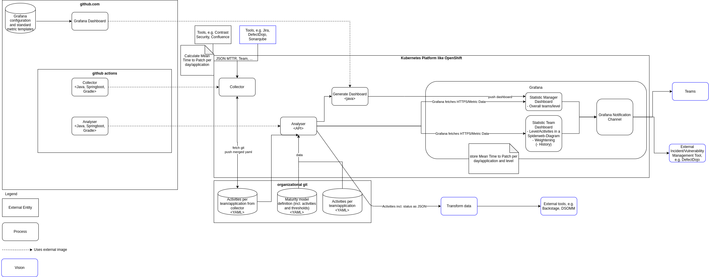

# MetricCA: Your Metrics Collection & Analysis Tool

## Table of Contents
- [Overview](#overview)
- [Features](#features)
- [Architecture](#architecture)
- [Process Flow](#process-flow)
- [Terms Used](#terms-used-in-this-project)
- [Deployment](#deployment)
- [Quick Start with Docker Desktop](#quick-start-with-docker-desktop)
- [Contributing](#contributing)
- [License](#license)
- [Sponsors](#sponsors)

## Overview

MetricCA is an open-source tool designed to collect, process, and showcase metrics from various development and documentation tools, assisting in keeping a real-time check over the performance and security aspects of your applications.

## Quick Start

Follow these steps to set up and run MetricCA locally:

1. **Clone the Repository:**
   ```bash
   git clone https://github.com/devsecopsmaturitymodel/metricCA.git
   cd metricCA
   ```

2. **Deploy in Kubernetes:**
   Ensure Kubernetes is enabled in Docker Desktop or Minikube.

   ```bash
   kubectl create ns metricca
   kubectl apply -k deployment/kustomizations/base -n metricca
   ```

3. **Set Up Secrets:**
   Follow the instructions in the [metricAnalyzer](https://github.com/devsecopsmaturitymodel/metricAnalyzer?tab=readme-ov-file#local-run) repository to get a token and a datasource ID.

   Update `deployment/kustomizations/overlay/secrets/metric-analyzer.secret.yaml` with your token, URL, and datasource ID.

   Update `deployment/kustomizations/overlay/secrets/collector-confluence.secret.yaml` with your Confluence credentials.

4. **Apply Secrets:**
   ```bash
   kubectl apply -k deployment/kustomizations/overlay/secrets -n metricca
   ```

5. **Access Grafana:**
   ```bash
   kubectl port-forward svc/grafana 3000:3000 -n metricca
   ```
   Open your browser and navigate to [http://localhost:3000](http://localhost:3000).

## Features

- **Manual YAML-based Metrics Collection:** Enabling non-technical folks to manage and modify metrics.
- **Automated Data Collection:** Direct API interactions with platforms like Jira, Confluence, and GitHub to fetch relevant data and process it.
- **Flexible Data Management:** Seamless handling of data with different structures and schemas.
- **Secure Workflow:** Integrated with secure review and approval workflows to ensure data integrity and security.

## Architecture

### Overview


MetricCA's architecture is divided into three primary components:
1. **Data Collection:** Fetches data from platforms like Jira, Confluence, and GitHub.
2. **Data Processing:** Processes and analyzes the collected data.
3. **Data Visualization:** Displays analyzed data in Grafana dashboards.

### Details


- **Kubernetes Deployment:** MetricCA is deployed in a Kubernetes cluster for scalability and reliability.
- **Secure Workflows:** Ensures data integrity through review and approval processes.
- **Extensible Design:** Allows integration with additional tools and platforms.

## Process Flow

### Manual YAML-based

YAMLs are machine-readable and allow non-technical people like Product Owners to modify them. Furthermore, YAMLs can be validated against a given schema.


This flow automatically provides the ability to review changes as a security team, and it provides a history in case Git is used.
The YAML repository should be under the control of the security team, and "Branch Protection" should be enabled, requiring a Pull Request and at least one person from the security team to approve the PR.

### Automatic Collection

From development environment tools like Jira, Confluence, or GitHub, the API can be utilized to fetch data. For example:
- In Confluence, all pages with the hashtag `#threatmodel` can be searched and analyzed.
- The GitHub API could be utilized to check for the Mean Time to Patch automatically created pull requests.

## Terms Used in this Project

- **application**: A program designed to fulfill a set of specific tasks or activities. Might consist of multiple microservices. Often called product.
- **team**: One team develops one or multiple applications.
- **product owner**: A role in agile frameworks, responsible for defining, prioritizing, and optimizing the work of the development team to deliver maximum value. As a risk owner, they also manage risks related to the product’s development, features, and usage.
- **notification**: Information about a missing activity.

## Deployment

### Deployment in a Kubernetes Cluster

1. **Copy the Deployment Folder:**
   - Copy the folder `deployment` or `deployment/kustomizations/overlay` to your infrastructure as code repository.

2. **Create a Namespace:**
   ```bash
   kubectl create ns metricca
   ```

3. **Apply the Base Configurations:**
   ```bash
   kubectl apply -k deployment/kustomizations/base -n metricca
   ```

4. **Set Up Secrets:**
   Follow the instructions in the [metricAnalyzer](https://github.com/devsecopsmaturitymodel/metricAnalyzer?tab=readme-ov-file#local-run) repository to get a token and a datasource ID.

5. **Apply Secrets:**
   ```bash
   kubectl apply -k deployment/kustomizations/overlay/secrets -n metricca
   ```

6. **Access Grafana:**
   - If you’re using Minikube:
     ```bash
     minikube service grafana -n metricca
     ```
   - If you’re using Docker Desktop or another Kubernetes setup:
     ```bash
     kubectl port-forward svc/grafana 3000:3000 -n metricca
     ```
   Open your browser and navigate to [http://localhost:3000](http://localhost:3000).

## Contributing

We welcome contributions from the community! Whether you’re a developer, designer, or documentation enthusiast, there are many ways to get involved.

### How to Contribute
1. **Fork the Repository:** Create your own copy of the repository.
2. **Create a New Branch:** Work on your changes in a separate branch.
3. **Submit a Pull Request:** Open a PR with a clear description of your changes.

### Contribution Guidelines
- Follow the coding standards and guidelines.
- Write clear and concise commit messages.
- Include tests for new features or bug fixes.

For more details, check out our [Contribution Guide](CONTRIBUTING.md).

## License

MetricCA is released under the MIT License.

## Sponsors


